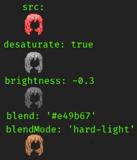
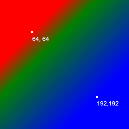

# Canvas renderer documentation

[[_TOC_]]

## Layer processing and composition

Example code that displays a single layer.

**JavaScript**:
```js
var canvas = Renderer.createCanvas(256, 256);
Renderer.composeLayers(canvas, [{
    src: "img/hair/sides/default/chest.png",
    desaturate: true,
    brightness: -0.3,
    blendMode: 'hard-light',
    blend: '#e49b67'
}]);
```
**SugarCube**:
```
<<canvasstart 256 256 1>>
<<canvaslayer 1 "img/hair/sides/default/chest.png" `{ desaturate: true, brightness: -0.3, blendMode: 'hard-light', blend: '#e49b67' }`>>
<<canvasdraw>>
```
The image will be processed in the following way:


Explanation of layer processing options:

<dl>
    <dt>src: string</dt>
    <dd>Image file path. Required.</dd>
    <dt>desaturate: boolean</dt>
    <dd>Convert to grayscale before processing. Optional, default false.</dd>
    <dt>brightness: number</dt>
    <dd>Adjust brightness before processing, from -1 (completely black) to +1 (completely white). Optional, default 0</dd>
    <dt>contrast: number</dt>
    <dd>Adjust contrast before processing, where 1 (default) is don't change, values in 0..1 reduce contrast (0 makes image gray) and values above 1 raise contrast.</dd>
    <dt>blend: string</dt>
    <dd>Blend color, CSS color string or gradient/pattern specification (see section at the bottom of the document). Optional, default none.</dd>
    <dt>blendMode: string</dt>
    <dd>Blend mode. Optional, default none. See <a href="https://developer.mozilla.org/en-US/docs/Web/API/CanvasRenderingContext2D/globalCompositeOperation" target="_blank">globalCompositionOperation docs</a> for list of modes</dd>
    <dt>masksrc: string</dt>
    <dd>Mask image file path. Optional. Result alpha = image alpha &times; mask alpha, so image pixels where mask is transparent will be removed. Mask color does not matter.</dd>
</dl>

In addition to processing, layer has composition-related options that govern how multiple layers are composed into single image:
<dl>
    <dt>z: number</dt>
    <dd>Display order, layers with higher numbers are rendered above others. Optional, default 0.</dd>
    <dt>name: string</dt>
    <dd>Layer name, for debugging. Optional</dd>
    <dt>show: boolean</dt>
    <dd>Render the layer. Optional, default true, and only exact "false" value prevents rendering.</dd>
    <dt>alpha: number</dt>
    <dd>Opacity from 0 (invisible) to 1 (opaque). Optional, default 1</dd>
    <dt>dx: number, dy: number</dt>
    <dd>Offset on the target canvas. Optional, default 0</dd>
    <dt>width: number, height: number</dt>
    <dd>Size of a single animation frame of the image. Optional, default auto-generated. Required if animated frame of this image is smaller than animated frame of target canvas.</dd>
</dl>

and several others covered in [Animations](#Animations) section.

## CanvasModel

Instead of composing layers manually from game state, the recommended way to render is to use *CanvasModel* – a reusable set of layers that uses externally supplied options object to configure its layers. CanvasModel layers can have computable properties that take model options and return layer property value.

For example, `hair_sides` layer is defined as:

```js
Renderer.CanvasModels["demo_model"] = {
    ...
    layers: {
        "hair_sides": {
            srcfn(options) {
                return 'img/hair/sides/' + options.hair_sides_type + '/' + options.hair_sides_length + '.png'
            },
            zfn(options) {
                if (options.hair_sides_position === "front") {
                    return ZIndices.hairforwards
                } else {
                    return ZIndices.backhair
                }
            },
            showfn(options) {
                return !!options.hair && !!options.hair_sides_type
            },
            filters: ["hair"]
        },
```

Here, `filters` property is constant, while `src`, `z`, and `show` are computed from options. *Options* for this model would be: `hair`, `hair_sides_type`, and `hair_sides_position`.

If model layer has no `show` or `showfn` property, it will be hidden by default and has to be explicitly displayed with `<<showlayer LAYER_NAME>>`.

*Model filters* are used to set same set of properties to multiple layers at once, for example, hair or clothing colours. They have same type of layer properties object and are stored in `filters` object in model options.

So, a model with 1 layer as described above could be used as

**JavaScript**
```js
var model = Renderer.locateModel("demo_model");
var options = model.defaultOptions();
options.hair = true;
options.hair_sides_type = "default";
options.hair_sides_position = "front";
options.filters.hair = { desaturate: true, brightness: -0.3, blendMode: 'hard-light', blend: '#e49b67' }
var canvas = model.createCanvas();
model.render(options);
```
SugarCube
```
<<selectmodel "demo_model">>
<<set _modeloptions.hair to true>>
<<set _modeloptions.hair_sides_type to "default">>
<<set _modeloptions.hair_sides_position to "front">>
<<modelfilter "hair" `{ desaturate: true, brightness: -0.3, blendMode: 'hard-light', blend: '#e49b67' }`>>
<<rendermodel>>
```

Known hair colours are stored in setup.colours.hair_map and could be referenced like this instead:
```js
options.filters.hair = setup.colours.hair_map["lightbrown"].canvasfilter;
```
Or the model can have hair_colour option and do the lookup itself in its preprocess function:
```js
Renderer.CanvasModels["demo_model"] = {
    ...
    preprocess(options) {
        options.filters.hair = setup.colours.hair_map[options.hair_colour].canvasfilter;
    }
```

## Animations

There are two ways to animate canvases: generate a spritesheet and CSS-animate it, and JavaScript animations, updating canvas every frame.

For CSS animations you can control which sub-sprites are rendered using layer's `frames` property. It should be an array of size = number of animation frames, and its values are subsprite indices.
For example, if most layers have 2-frame idle animation, but as an exception, eyelids layer 2nd frame is "closed eyes" and you want it to always use frame 0 instead, add `frames: [0, 0]` property to it.
Static 1-frame images need no conversion or configuration for animation, they will be repeated for all frames.

JavaScript animations are stored in `Renderer.Animations` object:
```js
Renderer.Animations["idle"] = {
    keyframes: [{
        frame: 0,
        duration: 1000
    }, {
        frame: 1,
        duration: 1000
    }]
};
```
or, for animations with same frame count:
```js
Renderer.Animations["idle"] = {
    frames: 2,
    duration: 1000
}
```

Durations are in milliseconds and `frame` refers to sub-sprite in the layer sprite.
Animations are referenced by its name in the model layer's `animation` property, and can be functions (`animationfn(options) { ... }`).

### Animating layer properties

Animatable layer properties are: `show`, `alpha`, `blend`, `brightness`, `contrast`, `dx`, `dy`. They should be specified in animation keyframes.

Example:
```js
Renderer.Animations["idle_redblue"] = {
    keyframes: [{
        frame: 0,
        duration: 1000,
        blend: "#ff0000"
    }, {
        frame: 1,
        duration: 1000,
        blend: "#0000ff"
    }
};
```

## SugarCube widgets

### Model API

#### \<\<selectmodel NAME \[INSTANCE]>>
Select model and prepare for rendering
Parameter `INSTANCE` is id for caching between passages.
Do not render instance multiple times on same passage.

#### \<\<showlayer LAYERNAME \[...FILTERS]>>
Show layer and optionaly add filters

#### \<\<hidelayer LAYERNAME>>
Hide layer

#### \<\<modelfilter FILTERNAME FILTER>>
Set model filter object.
Will do a copy, so you can safely edit filter options

#### \<\<modelfilterset FILTERNAME OPTIONNAME OPTIONVALUE>>
Set model filter option

#### \<\<animatemodel \[CSSCLASS]>>
Render model and JS-animate it

#### \<\<rendermodel \[CSSCLASS] \[CSSANIM]>>
Render model as a static image
If `CSSANIM` is true (default false), render multiple frames for CSS animation

### Low-level API

#### \<\<canvasstart WIDTH HEIGHT FRAMES>>
Creates an off-screen `<canvas>` element and empty layers array.

#### \<\<canvaslayer Z SRC \[OPTIONS...]*>>
Prepares a layer to be rendered
* `Z`: layer z property
* `SRC`: layer src property
* `OPTIONS`: Extra layer option objects - they are merged, last has most priority

Alternative way to call:
```
<<run canvaslayer(...z|src|options)>>
````
Arguments are processed depending on their type: string is `src`, number is `z`, and object is layer options. Leftmost arguments have more priority.

#### \<\<canvasanimate \[CSS_CLASSES]>>
Insert HTML `<canvas>` element right here.
Render and animate previously prepared images into it.

#### \<\<canvasdraw \[FRAMECOUNT] \[CSS_CLASSES]>>
Insert HTML `<canvas>` element right here.
Render previously prepared images into it.

## Gradients & Patterns

Instead of fixed color string, layer's `blend` property can define a linear or radial gradient, or a pattern.

### Gradients

A gradient specification is a JSON object of structure:
* `gradient: "linear"|"radial"` - type of the gradient.
* `values: number[]` - gradient coordinates. For linear gradient: `[x0, y0, x1, y1]`; for radial gradient: `[x0, y0, r0, x1, y1, r1]`. The coordinates are in pixels, relative to canvas top left corner.
* `colors` - color stops, array of either pairs `[offset:number, color:string]` (where `offset` is position between 0 and 1), or simply `color` strings (in that case, `offset` is generated to create evenly spaced stops). 

Example:
```js
T.modeloptions.hair_colour = "custom";
T.modeloptions.filters.hair = {
    blend: {
        gradient: "linear",
        values: [64, 64, 192, 192],
        colors: [ 'red', [0.25,'green'], 'blue' ]
        // ==   [ [0.0,'red'], [0.25,'green'], [1.0,'blue']]
    },
    blendMode: "hard-light",
    desaturate: true
}
```
will apply following gradient coloring to the layer:


See <a href="https://developer.mozilla.org/en-US/docs/Web/API/CanvasRenderingContext2D/createLinearGradient" target="_blank">createLinearGradient</a>, <a href="https://developer.mozilla.org/en-US/docs/Web/API/CanvasRenderingContext2D/createRadialGradient" target="_blank">createRadialGradient</a>, and <a href="https://developer.mozilla.org/en-US/docs/Web/API/CanvasGradient/addColorStop" target="_blank">addColorStop</a> documentation with more details and examples.

### Patterns

Patterns are images that are tiled horizontally and vertically, and applied to the layer with specified blend mode.

```js
T.modeloptions.worn_upper_colour = "custom";
T.modeloptions.filters.worn_lower_custom = {
    blend: { pattern:"wolfharmony" }, 
    blendMode:"hard-light"
}
```
Result:


Pattern image in this example is . It is registered in `game/04-Variables/canvasmodel-patterns-lib.js` file.

It is also possible to define a procedurally generated pattern that takes parameters. See same file.
